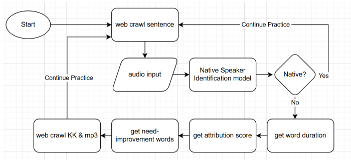

# Native Speech Enhancer Application

This project focuses on developing a **native speech enhancement application**. We utilize **WavLM** as the upstream model to extract features from the **L2-Arctic** and **VCTK-Corpus** datasets. These features are then fed into a downstream linear model to determine whether a given speech audio sample originates from a native speaker.

After training the model, we leverage **attribution scores** to analyze its decision-making process. Additionally, we introduce an **attribution loss** to fine-tune the model, encouraging it to focus more on pronunciation errors.

We demonstrate our project using **Gradio** and integrate **Whisper** to enhance its practical application. The relevant code can be found in `/code/application/hw2_application.ipynb`.

## Workflow of our application:

<p align="center">
  
</p>

The link for our demo video:
[Demo Video](https://drive.google.com/file/d/1L-vLArXM2lbTYizlsKrkhCtQKvx2pM-J/view?resourcekey&pli=1)

## Installation

To get started with the project, follow these steps:

1. **Clone the repository**:
    ```bash
    git clone https://github.com/snooow1029/Native-speaker-identification.git
    cd Native-speaker-identification
    ```

2. **Create a virtual environment** (optional but recommended):
    ```bash
    python3 -m venv env
    source env/bin/activate  # On Windows, use `env\Scripts\activate`
    ```

3. **Install the required dependencies**:
    ```bash
    pip install -r requirements.txt
    ```

## Usage

Once the environment is set up, you can run the application:

1. **Run the notebook** `/code/application/hw2_application.ipynb` in a Jupyter environment to demo the application.
    - Open the notebook(You may change the sentences to read).
    - Execute the code cells to interact with the application.
    - Upload the audio of your speech.


### Descriptions of Key Files and Folders:

- **`requirements.txt`**: Contains a list of Python dependencies required to run the project. You can install these by running `pip install -r requirements.txt`.

- **`code/`**: The main directory for all project code files.

  - **`application/`**: Includes the code to demonstrate the application, such as the Gradio-based interface and integration with Whisper for the demo.
  
  - **`binaryclass/`**: Code related to training and evaluating the native/non-native classification model. It handles tasks such as data loading(.npy), model training, model finetuning and evaluation.
  
  - **`checkpoints/`**: Contains the model checkpoint files that are saved during training, which can be loaded to continue training or for inference. Our latest checkpoint is **/code/checkpoints/checkpoint_epoch_finetune_on_TED_2.pth**.

  - **`inference.py`**: This script performs binary inference using a trained model. It processes input speech data, predicts whether the speaker is a native or non-native speaker, and generates an attribution score plot.

  - **`mining.py`**: A utility script for mining speech audio from Ted Talks on Youtube as out-of-distribution native dataset. We randomly extract 10 second pieces in the middle of the speech.

  - **`OOD_eval.py`**: This script evaluates the accuracy of detection. You may extract latent representation from WavLM first and saved them into .npy files so as to apply OOD_eval.py.

  - **`preprocess.py`**: Contains the code to preprocess the dataset (feed audio into SSL model such as WavLM) before feeding it into the downstream model for training.
